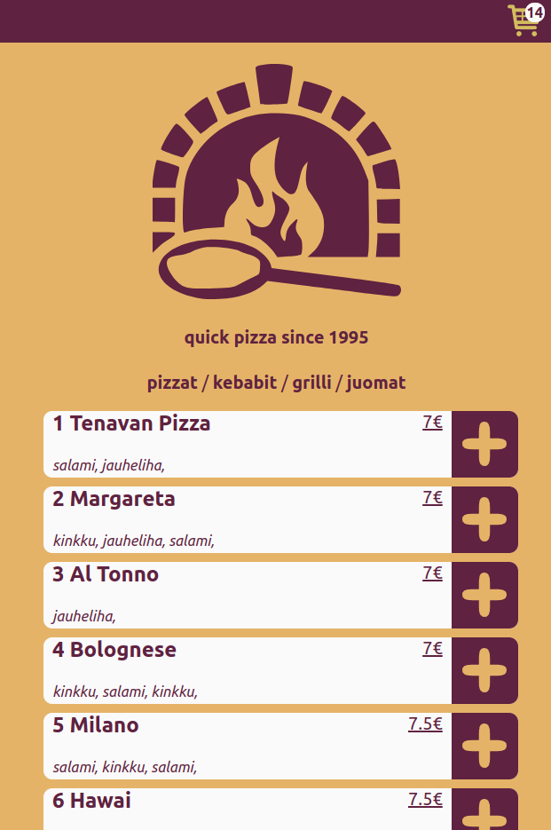

# pizza_mobile

generic pizzeria frontend for my own pleasure, im thinking of also doing a backend for orders etc. 
i went with the vanilla javascript route because i dont need
constant sql queries to get info on a product when all of the
products can be asked just once and their hidden info can be stored in their respective html element data attributes.

Vanilla JavaScript has versatile templating methods that are rarely utilized, maybe behind the scenes in larger frameworks but why use a framework when this just works!

im trying to boil this down to one js file and maybe minify to further speed up loading, 

